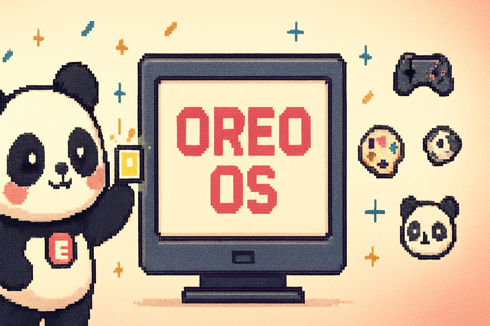
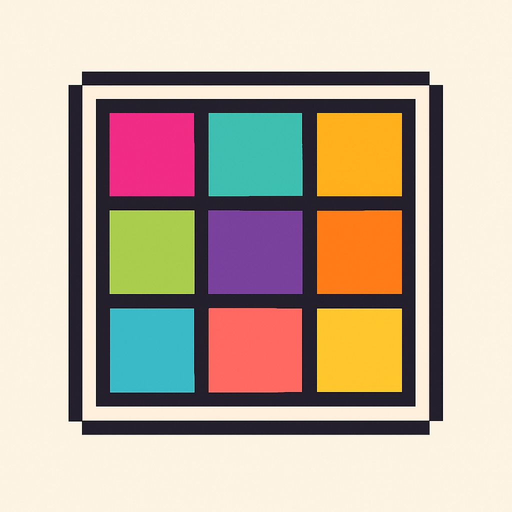
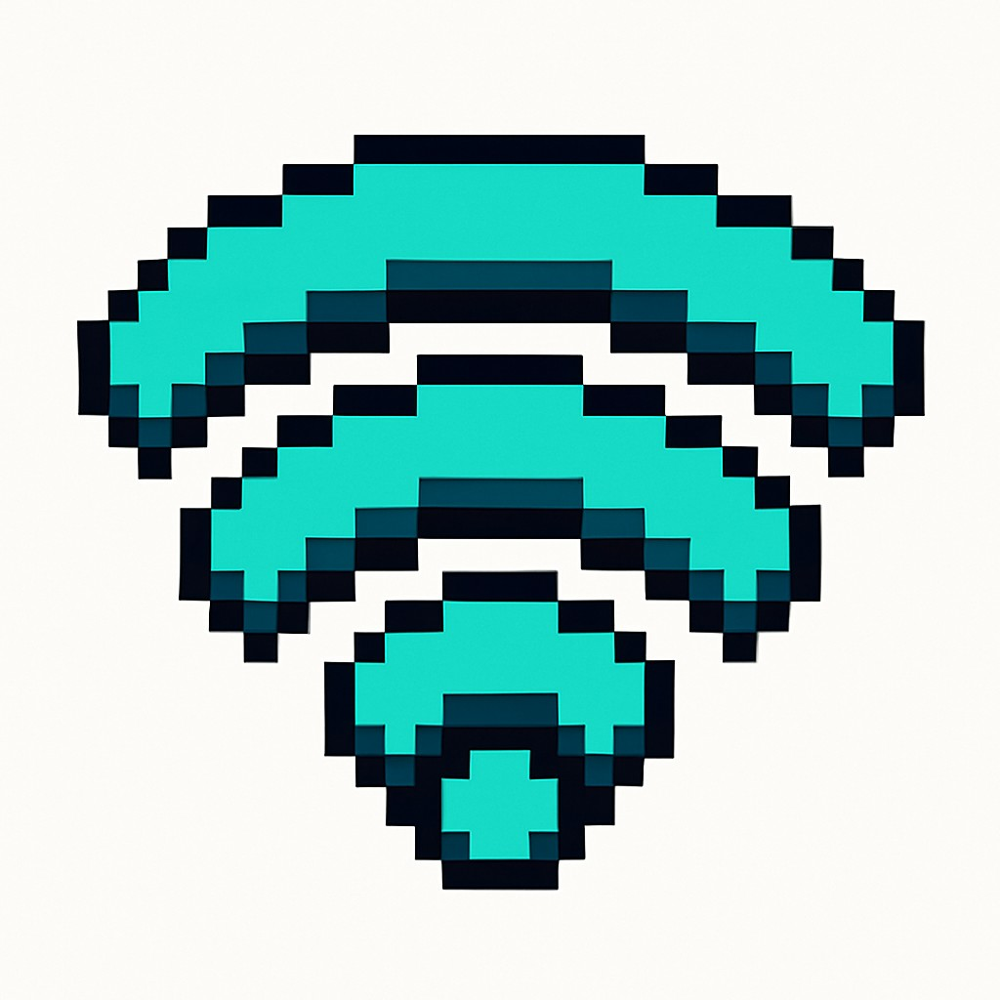
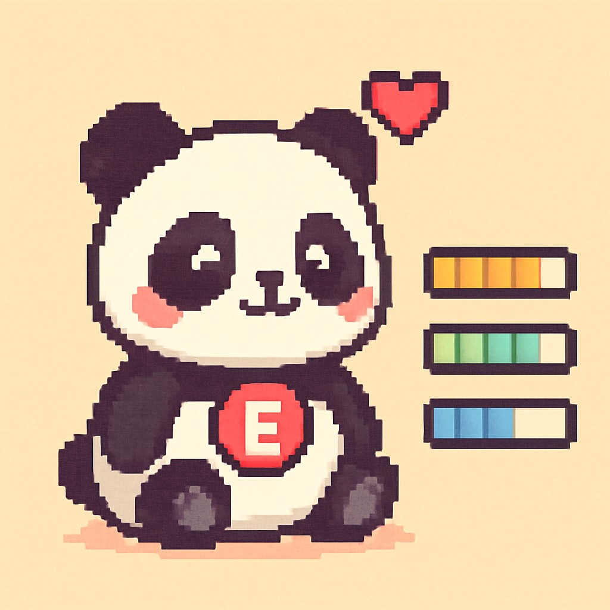
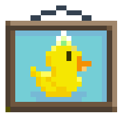
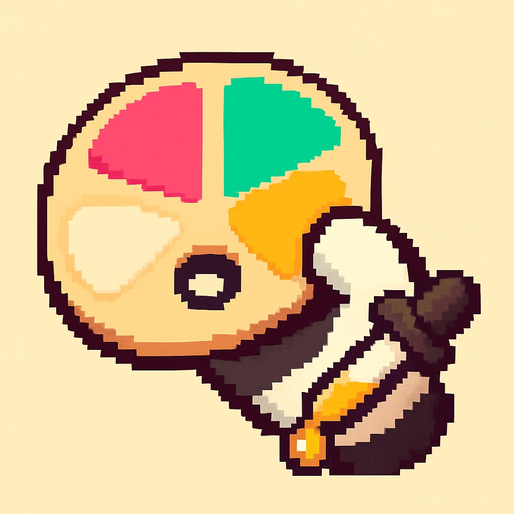
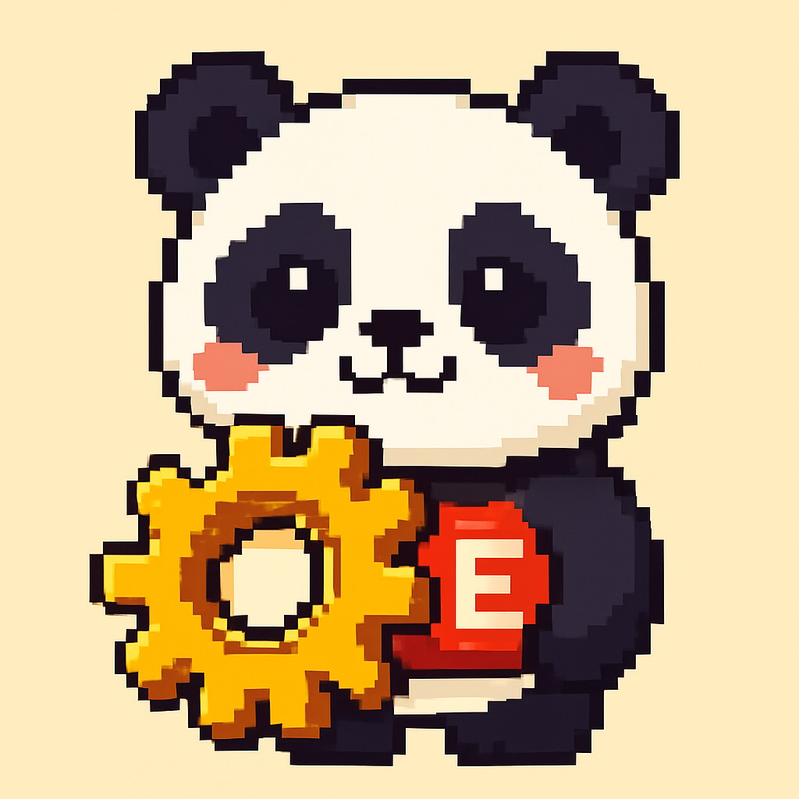

<div align="center">

<!-- Hero banner — regenerate any time with: python tools/_gen_banner.py -->


<br><br>


# Oreo Badge

**A handheld panda-themed conference badge that runs a real operating system.**

Made by [Elixpo](https://elixpo.com) · OS, mascot, and apps by [@Circuit-Overtime](https://github.com/Circuit-Overtime)

[](LICENSE)
[](https://micropython.org)
[](https://www.espressif.com/en/products/socs/esp32-s3)
[](#-updates)

[](https://elixpo.com)
[](https://github.com/elixpo/oreo/issues)
[](https://github.com/elixpo/oreo/stargazers)
[](https://github.com/sponsors/Circuit-Overtime)

</div>

---

<div align="center">

> *Hang it on your lanyard. Hand it to a stranger.*
> *Swap quests over IR. Watch your commits scroll past.*
> *Oreo is what happens when a conference name-tag grows up.*

</div>

---

## 🌟 At a glance

<table>
<tr>
<td width="33%" valign="top">

### 🖥 320 × 240 IPS display
A 2-inch full-colour LCD running at 33 fps with PWM-dimmed backlight. Every app you write gets the same framebuffer + theme palette.

</td>
<td width="33%" valign="top">

### 🐼 Built-in app SDK
`class App(oreoOS.App):` with three methods is all it takes. Copy `templates/example_app/`, edit, deploy. Your icon shows up in the launcher.

</td>
<td width="33%" valign="top">

### 📡 Real WiFi + Bluetooth
Weather, GitHub commits, OTA updates — all live. WiFi power-capped at 11 dBm so a bench supply can run it. BLE for badge-to-badge swaps.

</td>
</tr>
<tr>
<td valign="top">

### 🎮 12 apps shipped
Games, GitHub tools, IR quests, a colour picker, a panda you take care of across days. All open-source under one warm cream theme.

</td>
<td valign="top">

### 🔄 Over-the-air updates
The badge SHA-checks GitHub Releases in the background. Small patches install themselves. Big updates wait for your confirmation.

</td>
<td valign="top">

### 🤝 Talks to other badges
IR beacons, BLE advertise + scan, a quest system. Hand someone your badge — they hand you back a new app, a new puzzle, a new high score.

</td>
</tr>
</table>

---

## 🎮 The apps

Every tile in the drawer is its own folder under [`apps/`](apps/),
written as a small `class App(oreoOS.App)` with three lifecycle methods.

<div align="center">

| | | | | |
|:-:|:-:|:-:|:-:|:-:|
| <br>**Apps** | <br>**Badge** | <br>**Identity** | <br>**Commits** | <br>**Weather** |
| <br>**Pet** | <br>**Racer** | <br>**Flappy** | <br>**Snake** | <br>**Gamepad** |
| <br>**Gallery** | <br>**Color** | <br>**IR Quest** | <br>**Settings** | <br>**About** |

</div>

Want to add yours? Copy [`templates/example_app/`](templates/example_app/) into `apps/your_name/` and ship.

---

## 🚀 Get going

```bash
git clone https://github.com/elixpo/oreo
cd oreo
python -m venv .venv && source .venv/bin/activate
pip install -r oreoOS/requirements.txt
python tools/deploy.py /dev/ttyACM0      # flash to a connected board
```

For step-by-step app-writing + OS internals, see [`CONTRIBUTING.md`](CONTRIBUTING.md).

---

## 🛠 Hardware

| | |
|---|---|
| **MCU** | ESP32-S3-DevKitC-1-N16R8 (16 MB flash, 8 MB PSRAM) |
| **Display** | ST7789 IPS, 2.0", 320×240, 4-wire SPI @ 40 MHz |
| **Input** | 8 tactile buttons + TTP223 capacitive touch pad |
| **Sensors** | MPU-6050 (6-DoF IMU), TSOP38238 (IR RX) |
| **Output** | 4 corner LEDs, WS2812 status NeoPixel, IR LED (940 nm) + 2N2222 driver |
| **Comms** | WiFi 802.11 b/g/n, BLE 5.0, IR, USB-C |
| **Power** | 18650 cell + MAX17048 fuel gauge, USB-C charging, AMS1117-3.3 LDO |

📄 **Full electrical / mechanical specs:** see [`docs/DATASHEET.md`](docs/DATASHEET.md)
🔧 **Build guide + pinout + soldering tips:** see [`docs/HARDWARE.md`](docs/HARDWARE.md)

The single source of truth for every GPIO assignment is
[`oreoWare/pins.py`](oreoWare/pins.py) — one file, one line per pin.

---

## 🔄 Updates

The badge pulls itself forward. A fast SHA-vs-version check runs in the background against the project's GitHub release channel. **Small patches** (≤ 80 KB) install themselves; **big updates** wait for your explicit yes. Files are validated by SHA-256 and atomically swapped on the next boot — if anything goes wrong mid-download, the badge keeps running its old version.

Cutting a release takes one command: `python tools/release.py`. Details in [`CONTRIBUTING.md → Releasing`](CONTRIBUTING.md#releasing).

---

## 📚 Reading order

| | |
|---|---|
| 👋 **Just want to use it?** | this README + [`docs/HARDWARE.md`](docs/HARDWARE.md) |
| 🧑‍💻 **Want to write an app?** | [`CONTRIBUTING.md`](CONTRIBUTING.md) + [`templates/example_app/`](templates/example_app/) |
| 🔌 **Building your own PCB?** | [`docs/DATASHEET.md`](docs/DATASHEET.md) + [`oreoWare/pins.py`](oreoWare/pins.py) |
| 🤝 **Joining the community?** | [`CODE_OF_CONDUCT.md`](CODE_OF_CONDUCT.md) + [`SUPPORT.md`](SUPPORT.md) |
| 🛡 **Found a vulnerability?** | [`SECURITY.md`](SECURITY.md) |
| 📖 **Citing OreoOS?** | [`CITATION.cff`](CITATION.cff) |

A docs index lives at [`docs/README.md`](docs/README.md).

---

## 🙌 Contributing

We love new contributors. The bar is low; the welcome is warm.

- 🐛 Bugs / ideas: open an [issue](https://github.com/elixpo/oreo/issues/new/choose)
- 🔧 Code: read [`CONTRIBUTING.md`](CONTRIBUTING.md)
- 🧑‍🤝‍🧑 Community: read the [`Code of Conduct`](CODE_OF_CONDUCT.md)
- 🔐 Security disclosures: read [`SECURITY.md`](SECURITY.md)

---

## ⭐ Star history

<a href="https://www.star-history.com/#elixpo/oreo&Date">
  <picture>
    <source media="(prefers-color-scheme: dark)" srcset="https://api.star-history.com/svg?repos=elixpo/oreo&type=Date&theme=dark" />
    <source media="(prefers-color-scheme: light)" srcset="https://api.star-history.com/svg?repos=elixpo/oreo&type=Date" />
    
  </picture>
</a>

---

## 📫 Made by

OreoOS, the mascot, the apps, and pretty much everything in this repo
is the work of [**@Circuit-Overtime**](https://github.com/Circuit-Overtime).
The Oreo Badge ships as a project under the
[**Elixpo**](https://elixpo.com) umbrella.

Want to help, ship an app, sponsor a build, or just say hi?

<div align="center">

✉️  **hello@elixpo.com**

</div>

<!-- Bottom wave — same rainbow, mirrored -->
<picture>
  <source media="(prefers-color-scheme: dark)" srcset="https://capsule-render.vercel.app/api?type=waving&color=0:B45DFF,15:5D9BFF,30:00B4A5,50:6BD968,70:FFBE1E,85:FF9A3C,100:FF5D68&height=140&section=footer">
  
</picture>
